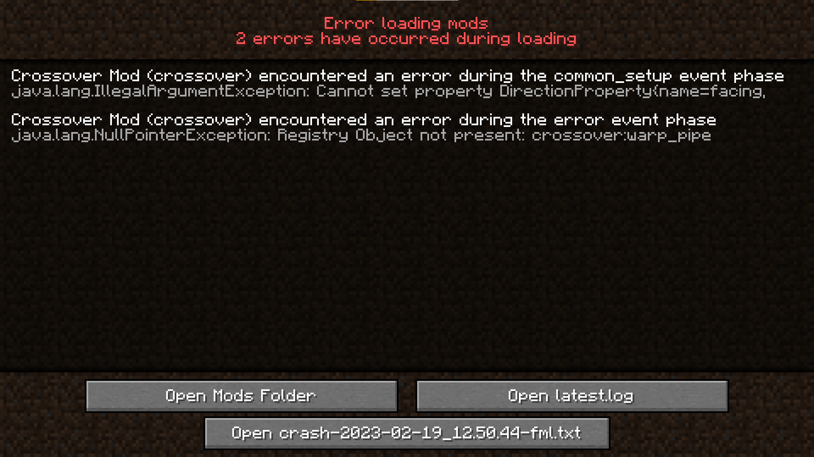
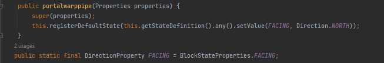
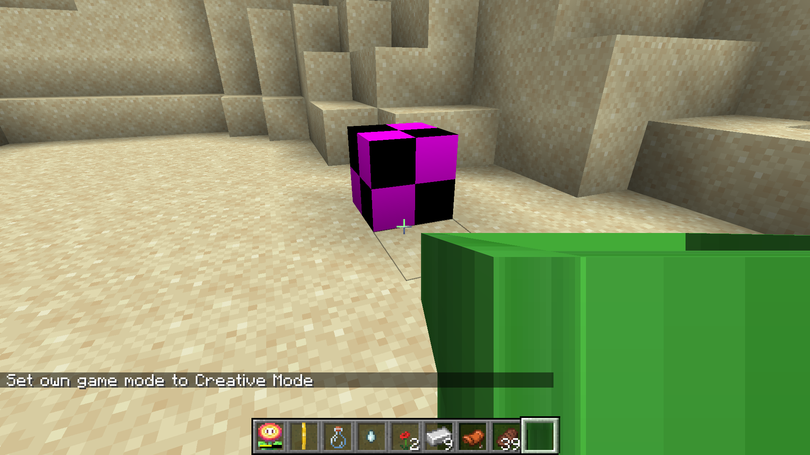

I got this problem: 
I know it's in portalwarppipe.java here:

If I were to move the code from the image above, It works fine, but I want my block to face in all directions and have a voxel shape
There's also another problem I have, the item model for warp_pipe.json works, but the block model doesn't. I don't know where the problem is
